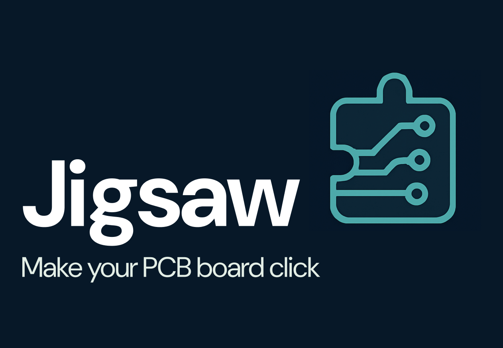
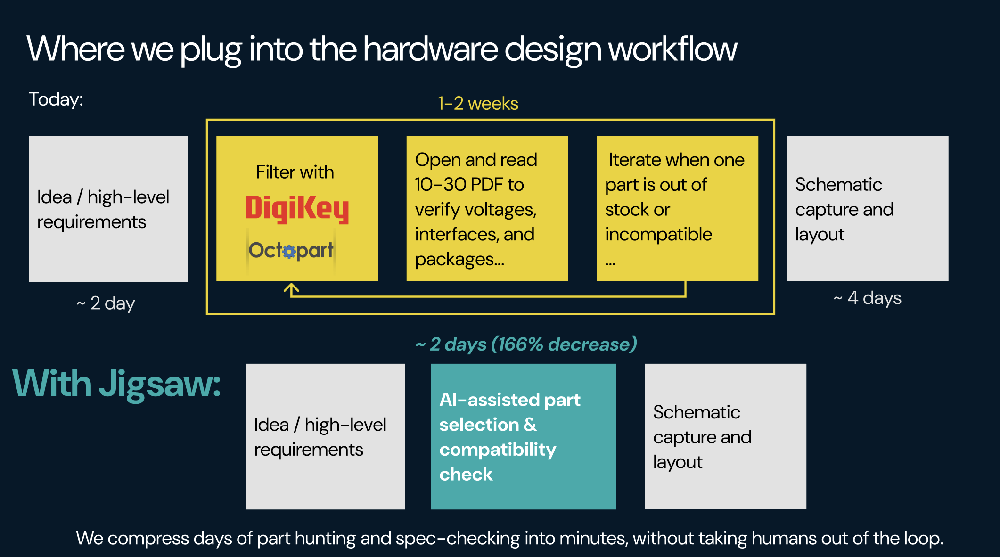
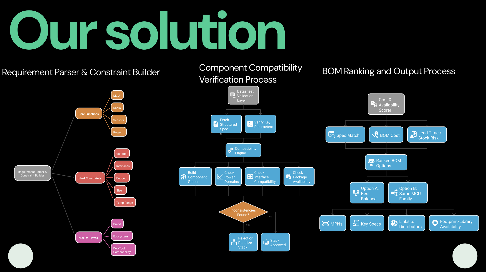
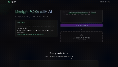
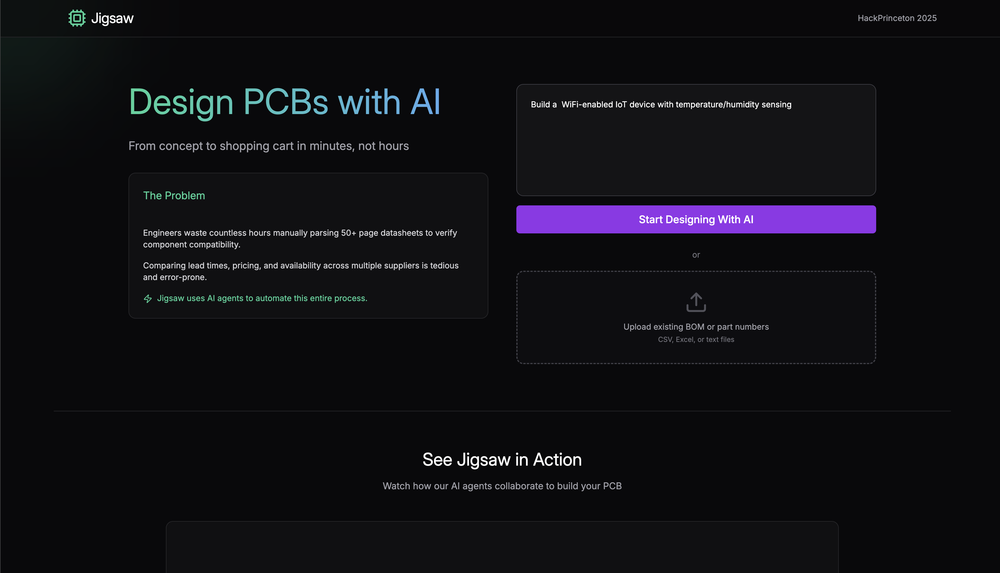

<div align="center">



**From natural language to complete PCB design in minutes, not hours.**

[View Demo](#demo) • [Pitch Deck](https://www.figma.com/slides/94eWyD99wBcK8kr5nobDi2/Jigsaw?node-id=1-510&t=PplOcCx70slVACQC-1) • [Installation](#installation)

</div>

---

## The Problem

Hardware engineers spend days—sometimes weeks—manually researching components, cross-referencing datasheets, and building Bill of Materials. What should be a creative design process becomes a tedious research task.

**The pain points:**

- Parsing 50+ page datasheets to verify compatibility
- Comparing pricing and availability across multiple suppliers
- Cross-referencing voltage requirements, pin configurations, and interface protocols
- Building BOMs from scratch, prone to human error

This is work that should be automated.

---

## Where We Fit

<div align="center">



</div>

Jigsaw sits at the intersection of AI-powered design automation and hardware engineering. We're not replacing engineers—we're amplifying their capabilities by handling the research and validation work, so they can focus on innovation.

---

## Our Solution

<div align="center">



</div>

Jigsaw uses AI agents powered by Model Context Protocol to automate the entire PCB design workflow. Describe your circuit in natural language, and watch as our system:

1. **Analyzes requirements** and identifies components hierarchically
2. **Searches suppliers** for optimal parts based on specs, pricing, and availability
3. **Validates compatibility** across all components (voltage, interfaces, pin counts)
4. **Generates complete BOM** with real-time pricing and specifications

The magic? You see the AI reason through each component selection in real-time, just like a senior hardware engineer would.

---

## Demo

<div align="center">



**[View Full Pitch Deck →](https://www.figma.com/slides/94eWyD99wBcK8kr5nobDi2/Jigsaw?node-id=1-510&t=PplOcCx70slVACQC-1)**

</div>

<div align="center">



</div>

**What you get:**

- Real-time component analysis with AI reasoning snippets
- Interactive PCB viewer with smart component placement
- Complete parts list with pricing and datasheet links
- Context-aware chat for iterative refinement

---

## How It Works

**Modular Architecture**

Self-contained MCP services handle all AI communication. The frontend streams real-time component analysis via Server-Sent Events, while the PCB viewer uses intelligent grid-based placement for optimal component organization.

**Hierarchical Reasoning**

AI analyzes components in logical order (MCU → Power → Sensors → Passives), ensuring compatibility at each step before proceeding. This mirrors how experienced engineers approach design.

**Context-Aware Intelligence**

When requirements are ambiguous, the AI asks clarifying questions. The system seamlessly pauses analysis, waits for context, then resumes—maintaining state throughout the conversation.

---

## Installation

```bash
git clone https://github.com/yourusername/jigsaw.git
cd jigsaw/Jigsaw/frontend
npm install
npm run dev
```

Set `VITE_MCP_SERVER_URL` in `.env` for backend integration.

---

## Quick Start

1. Describe your circuit in natural language
2. Watch AI analyze components in real-time
3. Refine with chat if more context is needed
4. Review BOM and export or purchase

---

## Key Innovations

**Real-time Streaming**

Server-Sent Events with intelligent buffering ensure reliable component analysis updates, even with network variability.

**Smart PCB Layout**

Grid-based placement system prevents overlap and optimizes component organization, creating layouts that actually make sense.

**Type-Safe Architecture**

Centralized type definitions ensure consistency across frontend and backend, reducing integration errors and speeding development.

---

## Documentation

- [MCP API Contract](./Jigsaw/frontend/app/services/mcp/MCP_API_CONTRACT.md) - Chat API specification
- [Component Analysis API](./Jigsaw/frontend/app/services/mcp/COMPONENT_ANALYSIS_API_CONTRACT.md) - Analysis API specification
- [Implementation Guide](./Jigsaw/frontend/app/services/mcp/README.md) - Backend integration

---

## Future Roadmap

Auto-routing • 3D PCB preview • Export formats (KiCad, Altium) • Direct supplier ordering • Team collaboration

---

## Team

**Charles Muehlberger** • **Luke Sanborn** • **Phu Duong**

Built at **HackPrinceton 2025**

---

<div align="center">

**Made with ⚡ by the Jigsaw Team**

[⬆ Back to Top](#jigsaw)

⭐ **Star us on GitHub** if you find this project helpful!

**Questions?** Open an issue or check out our [Pitch Deck](https://www.figma.com/slides/94eWyD99wBcK8kr5nobDi2/Jigsaw?node-id=1-510&t=PplOcCx70slVACQC-1) for more details.

</div>
